# 📋 INVENTARIO DE TRANSACCIONES - BUCARABUS

> Sistema de gestión de transporte urbano BucaraBus  
> **Fecha**: 16 de febrero de 2026  
> **Versión**: 1.0

---

## 📑 ÍNDICE

1. [Resumen Ejecutivo](#resumen-ejecutivo)
2. [Tabla Detallada de Operaciones](#-tabla-detallada-de-operaciones)
3. [Usuarios (Users)](#1-usuarios-users)
4. [Conductores (Drivers)](#2-conductores-drivers)
5. [Buses](#3-buses)
6. [Rutas (Routes)](#4-rutas-routes)
7. [Viajes (Trips)](#5-viajes-trips)
8. [Asignaciones (Assignments)](#6-asignaciones-assignments)
9. [Turnos (Shifts)](#7-turnos-shifts)
10. [GPS & Rastreo](#8-gps--rastreo)
11. [Geocodificación](#9-geocodificación)
12. [Matriz de Transacciones](#-matriz-de-transacciones-por-entidad)
13. [Auditoría y Trazabilidad](#-auditoría-y-trazabilidad)
14. [Flujos de Trabajo](#-flujos-de-trabajo-principales)
15. [Validaciones](#-validaciones-importantes)
16. [Configuraciones](#️-configuraciones-del-sistema)

---

## RESUMEN EJECUTIVO

### Estadísticas Generales

| Categoría | Total |
|-----------|-------|
| **Entidades principales** | 8 |
| **Funciones PostgreSQL** | 15 |
| **Servicios Backend** | 8 |
| **Endpoints API** | 60 operaciones |
| **Stores Frontend** | 6 |
| **Operaciones CREATE** | 10 |
| **Operaciones READ** | 25 |
| **Operaciones UPDATE** | 18 |
| **Operaciones DELETE** | 8 |

### Stack Tecnológico

- **Base de datos**: PostgreSQL 17 + PostGIS
- **Backend**: Node.js + Express.js
- **Frontend**: Vue 3 + Pinia
- **ID del Sistema**: `1` (usuario sistema)

### Resumen de Operaciones por Entidad

| Entidad | Total Ops | CREATE | READ | UPDATE | DELETE | Descripción |
|---------|-----------|--------|------|--------|--------|-------------|
| **Usuarios** | 9 | 2 | 3 | 3 | 1 | Gestión de usuarios y roles |
| **Conductores** | 8 | 1 | 3 | 3 | 1 | CRUD completo + toggles |
| **Buses** | 9 | 1 | 5 | 2 | 1 | CRUD + estadísticas + docs |
| **Rutas** | 10 | 1 | 3 | 5 | 1 | CRUD + visibilidad + paradas |
| **Viajes** | 10 | 2 | 3 | 4 | 2 | Individual/batch + cancelar |
| **Asignaciones** | 3 | 1 | 1 | 0 | 1 | Conductor ↔ Bus |
| **Turnos** | 5 | 1 | 3 | 1 | 0 | Gestión de horarios |
| **GPS** | 6 | 1 | 4 | 0 | 1 | Rastreo en tiempo real |
| **TOTAL** | **60** | **10** | **25** | **18** | **8** | |

---

## 📊 TABLA DETALLADA DE OPERACIONES

### Operaciones por Entidad

| # | Entidad | Operación | Método | Endpoint | Tipo | Detalles |
|---|---------|-----------|--------|----------|------|----------|
| **1** | **USUARIOS** | | | | | **9 operaciones** |
| 1.1 | Usuarios | Listar usuarios | GET | `/api/users` | READ | Con filtros opcionales |
| 1.2 | Usuarios | Obtener por ID | GET | `/api/users/:id` | READ | Usuario específico |
| 1.3 | Usuarios | Crear usuario | POST | `/api/users` | CREATE | Nuevo usuario base |
| 1.4 | Usuarios | Actualizar usuario | PUT | `/api/users/:id` | UPDATE | Datos generales |
| 1.5 | Usuarios | Cambiar contraseña | PUT | `/api/users/:id/password` | UPDATE | Hash bcrypt |
| 1.6 | Usuarios | Toggle estado | PUT | `/api/users/:id/status` | UPDATE | Activar/desactivar |
| 1.7 | Usuarios | Obtener roles | GET | `/api/users/:id/roles` | READ | Roles asignados |
| 1.8 | Usuarios | Asignar rol | POST | `/api/users/:id/roles` | CREATE | Nuevo rol |
| 1.9 | Usuarios | Remover rol | DELETE | `/api/users/:id/roles/:roleId` | DELETE | Quitar rol |
| **2** | **CONDUCTORES** | | | | | **8 operaciones** |
| 2.1 | Conductores | Listar conductores | GET | `/api/drivers` | READ | Todos o solo activos |
| 2.2 | Conductores | Listar disponibles | GET | `/api/drivers/available` | READ | Solo disponibles |
| 2.3 | Conductores | Obtener por ID | GET | `/api/drivers/:id` | READ | Conductor + detalles |
| 2.4 | Conductores | Crear conductor | POST | `/api/drivers` | CREATE | Usuario + detalles |
| 2.5 | Conductores | Actualizar conductor | PUT | `/api/drivers/:id` | UPDATE | Licencia, datos |
| 2.6 | Conductores | Toggle disponibilidad | PATCH | `/api/drivers/:id/availability` | UPDATE | Disponible/ocupado |
| 2.7 | Conductores | Toggle estado | PATCH | `/api/drivers/:id/status` | UPDATE | Activo/inactivo |
| 2.8 | Conductores | Eliminar conductor | DELETE | `/api/drivers/:id` | DELETE | Soft delete |
| **3** | **BUSES** | | | | | **9 operaciones** |
| 3.1 | Buses | Listar buses | GET | `/api/buses` | READ | Todos o solo activos |
| 3.2 | Buses | Listar disponibles | GET | `/api/buses/available` | READ | Sin conductor |
| 3.3 | Buses | Obtener estadísticas | GET | `/api/buses/stats` | READ | Total, activos, etc |
| 3.4 | Buses | Docs por vencer | GET | `/api/buses/expiring` | READ | SOAT, tecnomec. |
| 3.5 | Buses | Obtener por placa | GET | `/api/buses/:plate` | READ | Bus específico |
| 3.6 | Buses | Crear bus | POST | `/api/buses` | CREATE | Validar AMB-0001 |
| 3.7 | Buses | Actualizar bus | PUT | `/api/buses/:plate` | UPDATE | Docs, propietario |
| 3.8 | Buses | Toggle estado | PATCH | `/api/buses/:plate/status` | UPDATE | Activo/inactivo |
| 3.9 | Buses | Eliminar bus | DELETE | `/api/buses/:plate` | DELETE | Soft delete |
| **4** | **RUTAS** | | | | | **10 operaciones** |
| 4.1 | Rutas | Listar rutas | GET | `/api/routes` | READ | Todas las rutas |
| 4.2 | Rutas | Buscar rutas | GET | `/api/routes/search` | READ | Con filtros |
| 4.3 | Rutas | Obtener por ID | GET | `/api/routes/:id` | READ | Ruta + geometría |
| 4.4 | Rutas | Crear ruta | POST | `/api/routes` | CREATE | Con coordenadas |
| 4.5 | Rutas | Actualizar ruta | PUT | `/api/routes/:id` | UPDATE | Modificar trazado |
| 4.6 | Rutas | Eliminar ruta | DELETE | `/api/routes/:id` | DELETE | Soft delete |
| 4.7 | Rutas | Toggle visibilidad | PATCH | `/api/routes/:id/visibility` | UPDATE | Mostrar/ocultar |
| 4.8 | Rutas | Calcular distancia | GET | `/api/routes/:id/distance` | READ | PostGIS calc. |
| 4.9 | Rutas | Agregar paradas | POST | `/api/routes/:id/stops` | UPDATE | Puntos de parada |
| 4.10 | Rutas | Asignar buses | POST | `/api/routes/:id/buses` | UPDATE | Buses a ruta |
| **5** | **VIAJES** | | | | | **10 operaciones** |
| 5.1 | Viajes | Listar viajes | GET | `/api/trips` | READ | Con filtros |
| 5.2 | Viajes | Por ruta y fecha | GET | `/api/trips/:routeId/:date` | READ | Viajes del día |
| 5.3 | Viajes | Obtener por ID | GET | `/api/trips/single/:id` | READ | Viaje específico |
| 5.4 | Viajes | Crear viaje | POST | `/api/trips` | CREATE | Individual |
| 5.5 | Viajes | Crear batch | POST | `/api/trips/batch` | CREATE | Múltiples viajes |
| 5.6 | Viajes | Actualizar viaje | PUT | `/api/trips/:id` | UPDATE | Modificar horario |
| 5.7 | Viajes | Asignar bus | PATCH | `/api/trips/:id/bus` | UPDATE | Vincular bus |
| 5.8 | Viajes | Eliminar viaje | DELETE | `/api/trips/:id` | DELETE | Hard delete |
| 5.9 | Viajes | Eliminar por fecha | DELETE | `/api/trips/by-date/:routeId/:date` | DELETE | Batch delete |
| 5.10 | Viajes | Cancelar viaje | PATCH | `/api/trips/:id/cancel` | UPDATE | Cambiar estado |
| **6** | **ASIGNACIONES** | | | | | **3 operaciones** |
| 6.1 | Asignaciones | Asignar conductor | POST | `/api/assignments` | CREATE | Conductor a bus |
| 6.2 | Asignaciones | Ver historial | GET | `/api/assignments/bus/:plate` | READ | Asignaciones bus |
| 6.3 | Asignaciones | Desasignar | DELETE | `/api/assignments/:plate` | DELETE | Liberar bus |
| **7** | **TURNOS** | | | | | **5 operaciones** |
| 7.1 | Turnos | Listar turnos | GET | `/api/shifts` | READ | Todos los turnos |
| 7.2 | Turnos | Buses disponibles | GET | `/api/shifts/available-buses` | READ | Por turno |
| 7.3 | Turnos | Obtener por bus | GET | `/api/shifts/:plateNumber` | READ | Turno actual |
| 7.4 | Turnos | Crear turno | POST | `/api/shifts` | CREATE | Nuevo turno |
| 7.5 | Turnos | Actualizar progreso | PUT | `/api/shifts/:plateNumber/progress` | UPDATE | Viajes completados |
| **8** | **GPS** | | | | | **6 operaciones** |
| 8.1 | GPS | Registrar posición | POST | `/api/gps/snapshot` | CREATE | Coords + timestamp |
| 8.2 | GPS | Historial viaje | GET | `/api/gps/trip/:id_trip` | READ | Todas posiciones |
| 8.3 | GPS | Última posición | GET | `/api/gps/trip/:id_trip/last` | READ | Posición actual |
| 8.4 | GPS | Por fecha | GET | `/api/gps/date/:date` | READ | Todos los viajes |
| 8.5 | GPS | Estadísticas | GET | `/api/gps/trip/:id_trip/statistics` | READ | Dist, velocidad |
| 8.6 | GPS | Limpiar datos | DELETE | `/api/gps/cleanup` | DELETE | Datos antiguos |

### Resumen por Tipo de Operación

| Tipo | Usuarios | Conductores | Buses | Rutas | Viajes | Asignaciones | Turnos | GPS | **TOTAL** |
|------|----------|-------------|-------|-------|--------|--------------|--------|-----|-----------|
| **CREATE** | 2 | 1 | 1 | 1 | 2 | 1 | 1 | 1 | **10** |
| **READ** | 3 | 3 | 5 | 3 | 3 | 1 | 3 | 4 | **25** |
| **UPDATE** | 3 | 3 | 2 | 5 | 4 | 0 | 1 | 0 | **18** |
| **DELETE** | 1 | 1 | 1 | 1 | 2 | 1 | 0 | 1 | **8** |
| **Total** | **9** | **8** | **9** | **10** | **10** | **3** | **5** | **6** | **60** |

### Categorías Funcionales

| Categoría | Operaciones | Descripción |
|-----------|-------------|-------------|
| **CRUD Básico** | 32 ops | Create, Read, Update, Delete estándar de entidades |
| **Búsqueda/Filtrado** | 8 ops | Listar con filtros, búsquedas especializadas |
| **Toggle/Status** | 6 ops | Cambiar estados booleanos (activo/inactivo, disponible/ocupado, visible/oculto) |
| **Relaciones** | 7 ops | Asignar/desasignar, asociar entidades (conductor-bus, bus-ruta) |
| **Estadísticas** | 4 ops | Conteos, cálculos de distancia, métricas agregadas |
| **Batch Operations** | 2 ops | Operaciones masivas (crear/eliminar múltiples registros) |
| **Especializadas** | 1 op | GPS tracking en tiempo real |

**Total**: 60 operaciones distribuidas en 8 entidades principales

---

## 1. USUARIOS (Users)

### Base de Datos

**Tabla**: `tab_users`

**Funciones PostgreSQL**:
- ✅ `fun_create_user` - Crear usuario
- ✅ `fun_update_user` - Actualizar usuario

### Backend

**Servicio**: `api/services/users.service.js`

**Métodos disponibles**:
- `getAllUsers(filters)` - Listar usuarios con filtros
- `getUserById(userId)` - Obtener usuario por ID
- `createUser(userData)` - Crear usuario
- `updateUser(userId, updates)` - Actualizar usuario
- `changePassword(userId, newPassword)` - Cambiar contraseña
- `toggleUserStatus(userId, isActive)` - Activar/desactivar usuario
- `getUserRoles(userId)` - Obtener roles de usuario
- `assignRole(userId, roleId, assignedBy)` - Asignar rol
- `removeRole(userId, roleId)` - Remover rol

### API Endpoints

**Rutas**: `api/routes/users.routes.js`

| Método | Endpoint | Descripción | Tipo |
|--------|----------|-------------|------|
| GET | `/api/users` | Listar todos los usuarios | READ |
| GET | `/api/users/:id` | Obtener usuario por ID | READ |
| POST | `/api/users` | Crear nuevo usuario | CREATE |
| PUT | `/api/users/:id` | Actualizar usuario | UPDATE |
| PUT | `/api/users/:id/password` | Cambiar contraseña | UPDATE |
| PUT | `/api/users/:id/status` | Cambiar estado activo/inactivo | UPDATE |
| GET | `/api/users/:id/roles` | Obtener roles de usuario | READ |
| POST | `/api/users/:id/roles` | Asignar rol a usuario | CREATE |
| DELETE | `/api/users/:id/roles/:roleId` | Remover rol de usuario | DELETE |

### Frontend

**Store**: `src/stores/users.js`

**Acciones**:
- `fetchUsers()` - Cargar lista de usuarios
- `createUser(userData)` - Crear usuario
- `updateUser(userId, updates)` - Actualizar usuario
- `toggleUserStatus(userId)` - Cambiar estado

---

## 2. CONDUCTORES (Drivers)

### Base de Datos

**Tablas**:
- `tab_users` - Datos base del usuario
- `tab_driver_details` - Detalles específicos del conductor

**Funciones PostgreSQL**:
- ✅ `fun_create_driver` - Crear conductor (crea usuario + detalles)
- ✅ `fun_update_driver` - Actualizar conductor
- ✅ `fun_delete_driver` - Eliminar conductor (soft delete)

### Backend

**Servicio**: `api/services/drivers.service.js`

**Métodos disponibles**:
- `getAllDrivers(onlyActive)` - Listar conductores
- `getDriverById(idUser)` - Obtener conductor por ID
- `createDriver(driverData)` - Crear conductor
- `updateDriver(idUser, driverData)` - Actualizar conductor
- `toggleAvailability(idUser, available)` - Cambiar disponibilidad
- `toggleStatus(idUser, status)` - Cambiar estado
- `getAvailableDrivers()` - Obtener conductores disponibles
- `deleteDriver(idUser)` - Eliminar conductor

**Parámetros para CREATE**:
```javascript
{
  email,           // VARCHAR(320) - único
  password,        // VARCHAR (hasheado con bcrypt)
  name,            // VARCHAR(100)
  id_card,         // INTEGER - único
  cel,             // VARCHAR(15)
  license_cat,     // VARCHAR(10) - Categoría de licencia
  license_exp,     // DATE - Fecha expiración licencia
  avatar,          // VARCHAR(500) - URL foto
  address,         // VARCHAR(200)
  user_create      // INTEGER (default: 1)
}
```

**Parámetros para UPDATE**:
```javascript
{
  name,            // VARCHAR(100)
  cel,             // VARCHAR(15)
  license_cat,     // VARCHAR(10)
  license_exp,     // DATE
  address,         // VARCHAR(200)
  avatar,          // VARCHAR(500)
  available,       // BOOLEAN
  user_update      // INTEGER (default: 1)
}
```

### API Endpoints

**Rutas**: `api/routes/drivers.routes.js`

| Método | Endpoint | Descripción | Tipo |
|--------|----------|-------------|------|
| GET | `/api/drivers` | Listar todos los conductores | READ |
| GET | `/api/drivers/available` | Listar conductores disponibles | READ |
| GET | `/api/drivers/:id` | Obtener conductor por ID | READ |
| POST | `/api/drivers` | Crear nuevo conductor | CREATE |
| PUT | `/api/drivers/:id` | Actualizar conductor | UPDATE |
| PATCH | `/api/drivers/:id/availability` | Cambiar disponibilidad | UPDATE |
| PATCH | `/api/drivers/:id/status` | Cambiar estado activo/inactivo | UPDATE |
| DELETE | `/api/drivers/:id` | Eliminar conductor (soft delete) | DELETE |

### Frontend

**Store**: `src/stores/drivers.js`

**Acciones**:
- `fetchDrivers()` - Cargar lista de conductores
- `createDriver(driverData)` - Crear conductor
- `updateDriver(idUser, driverData)` - Actualizar conductor
- `deleteDriver(idUser)` - Eliminar conductor
- `toggleAvailability(idUser)` - Cambiar disponibilidad

**Modal**: `src/components/modals/DriverModal.vue`

---

## 3. BUSES

### Base de Datos

**Tabla**: `tab_buses`

**Funciones PostgreSQL**:
- ✅ `fun_create_bus` - Crear bus
- ✅ `fun_update_bus` - Actualizar bus
- ✅ `fun_toggle_bus_status` - Activar/desactivar bus

### Backend

**Servicio**: `api/services/buses.service.js`

**Métodos disponibles**:
- `getAllBuses(onlyActive)` - Listar buses
- `getBusByPlate(plateNumber)` - Obtener bus por placa
- `getAvailableBuses()` - Obtener buses disponibles
- `createBus(busData)` - Crear bus
- `updateBus(plateNumber, busData)` - Actualizar bus
- `toggleBusStatus(plateNumber, isActive, userUpdate)` - Cambiar estado
- `deleteBus(plateNumber, userUpdate)` - Eliminar bus (soft delete)
- `getBusesWithExpiringDocs(days)` - Buses con documentos por vencer
- `getBusStats()` - Estadísticas de buses

**Parámetros para CREATE**:
```javascript
{
  plate_number,    // VARCHAR(6) - Formato: ABC123
  amb_code,        // VARCHAR(8) - Formato: AMB-0001 (4 dígitos)
  id_company,      // INTEGER (1-99)
  capacity,        // INTEGER (10-999)
  photo_url,       // VARCHAR(500) - Opcional
  soat_exp,        // DATE - Vencimiento SOAT
  techno_exp,      // DATE - Vencimiento Tecnomecánica
  rcc_exp,         // DATE - Vencimiento RCC
  rce_exp,         // DATE - Vencimiento RCE
  id_card_owner,   // INTEGER - Cédula propietario
  name_owner,      // VARCHAR(100) - Nombre propietario
  user_create      // INTEGER (default: 1)
}
```

**Validaciones**:
- Placa: `^[A-Z]{3}[0-9]{3}$` (3 letras + 3 números)
- Código AMB: `^AMB-[0-9]{4}$` (AMB- + 4 dígitos)
- Capacidad: Entre 10 y 999
- Todas las fechas deben ser futuras

**Parámetros para UPDATE**:
```javascript
{
  amb_code,        // VARCHAR(8)
  capacity,        // INTEGER
  photo_url,       // VARCHAR(500)
  soat_exp,        // DATE
  techno_exp,      // DATE
  rcc_exp,         // DATE
  rce_exp,         // DATE
  id_card_owner,   // INTEGER
  name_owner,      // VARCHAR(100)
  user_update      // INTEGER (default: 1)
}
```

### API Endpoints

**Rutas**: `api/routes/buses.routes.js`

| Método | Endpoint | Descripción | Tipo |
|--------|----------|-------------|------|
| GET | `/api/buses` | Listar todos los buses | READ |
| GET | `/api/buses/available` | Listar buses disponibles | READ |
| GET | `/api/buses/stats` | Estadísticas de buses | READ |
| GET | `/api/buses/expiring` | Buses con docs por vencer | READ |
| GET | `/api/buses/:plate` | Obtener bus por placa | READ |
| POST | `/api/buses` | Crear nuevo bus | CREATE |
| PUT | `/api/buses/:plate` | Actualizar bus | UPDATE |
| PATCH | `/api/buses/:plate/status` | Cambiar estado activo/inactivo | UPDATE |
| DELETE | `/api/buses/:plate` | Eliminar bus (soft delete) | DELETE |

### Frontend

**Store**: `src/stores/buses.js`

**Acciones**:
- `fetchBuses()` - Cargar lista de buses
- `createBus(busData)` - Crear bus
- `updateBus(plateNumber, busData)` - Actualizar bus
- `toggleBusStatus(plateNumber)` - Cambiar estado
- `deleteBus(plateNumber)` - Eliminar bus

**Modal**: `src/components/modals/BusModal.vue`

---

## 4. RUTAS (Routes)

### Base de Datos

**Tabla**: `tab_routes`

**Funciones PostgreSQL**:
- ✅ `fun_create_route` - Crear ruta
- ✅ `fun_update_route` - Actualizar ruta
- ✅ `fun_delete_route` - Eliminar ruta (soft delete)

### Backend

**Servicio**: `api/services/routes.service.js`

**Métodos disponibles**:
- `getAllRoutes()` - Listar todas las rutas
- `getRouteById(id)` - Obtener ruta por ID
- `createRoute(routeData)` - Crear ruta
- `updateRoute(id, routeData)` - Actualizar ruta
- `deleteRoute(id, user)` - Eliminar ruta
- `getRouteDistance(id)` - Calcular distancia de ruta
- `getRouteTrips(id)` - Obtener viajes de una ruta
- `getRouteStats(id)` - Estadísticas de ruta
- `toggleVisibility(id)` - Cambiar visibilidad

**Parámetros para CREATE**:
```javascript
{
  name,            // VARCHAR(100) - Nombre de la ruta
  description,     // TEXT - Descripción opcional
  color,           // VARCHAR(7) - Color hex (#RRGGBB)
  coordinates,     // JSONB - Array de {lat, lng}
  stops,           // JSONB - Array de paradas (opcional)
  user             // INTEGER (default: 1)
}
```

**Parámetros para UPDATE**:
```javascript
{
  name,            // VARCHAR(100)
  description,     // TEXT
  color,           // VARCHAR(7)
  coordinates,     // JSONB
  stops,           // JSONB
  user             // INTEGER (default: 1)
}
```

### API Endpoints

**Rutas**: `api/routes/routes.routes.js`

| Método | Endpoint | Descripción | Tipo |
|--------|----------|-------------|------|
| GET | `/api/routes` | Listar todas las rutas | READ |
| GET | `/api/routes/search` | Buscar rutas | READ |
| GET | `/api/routes/:id` | Obtener ruta por ID | READ |
| POST | `/api/routes` | Crear nueva ruta | CREATE |
| PUT | `/api/routes/:id` | Actualizar ruta | UPDATE |
| DELETE | `/api/routes/:id` | Eliminar ruta (soft delete) | DELETE |
| PATCH | `/api/routes/:id/visibility` | Cambiar visibilidad | UPDATE |
| GET | `/api/routes/:id/distance` | Calcular distancia | READ |
| POST | `/api/routes/:id/stops` | Agregar paradas | UPDATE |
| POST | `/api/routes/:id/buses` | Asignar buses a ruta | UPDATE |

### Frontend

**Store**: `src/stores/routes.js`

**Acciones**:
- `fetchRoutes()` - Cargar lista de rutas
- `createRoute(routeData)` - Crear ruta
- `updateRoute(id, routeData)` - Actualizar ruta
- `deleteRoute(id)` - Eliminar ruta
- `toggleVisibility(id)` - Cambiar visibilidad

**Modal**: `src/components/modals/RouteModal.vue`

---

## 5. VIAJES (Trips)

### Base de Datos

**Tabla**: `tab_trips`

**Funciones PostgreSQL**:
- ✅ `fun_create_trip` - Crear viaje
- ✅ `fun_update_trip` - Actualizar viaje
- ✅ `fun_delete_trip` - Eliminar viaje

### Backend

**Servicio**: `api/services/trips.service.js`

**Métodos disponibles**:
- `createTrip(tripData)` - Crear viaje individual
- `createTripsBatch(batchData)` - Crear múltiples viajes
- `getTripsByRouteAndDate(id_route, trip_date)` - Viajes por ruta y fecha
- `getTripsByBusAndDate(plate_number, trip_date)` - Viajes por bus y fecha
- `getTripById(id_trip)` - Obtener viaje por ID
- `updateTrip(id_trip, updateData)` - Actualizar viaje
- `setTripBus(id_trip, plate_number, user_update)` - Asignar bus a viaje
- `deleteTrip(id_trip)` - Eliminar viaje
- `deleteTripsByDate(id_route, trip_date)` - Eliminar viajes por fecha
- `cancelTrip(id_trip, user_update)` - Cancelar viaje

**Parámetros para CREATE (individual)**:
```javascript
{
  id_route,        // INTEGER - ID de la ruta
  trip_date,       // DATE - Fecha del viaje
  start_time,      // TIME - Hora de inicio
  end_time,        // TIME - Hora de fin estimada
  plate_number,    // VARCHAR(6) - Placa del bus (opcional)
  id_shift,        // INTEGER - ID del turno (opcional)
  user_create      // INTEGER (default: 1)
}
```

**Parámetros para CREATE BATCH**:
```javascript
{
  id_route,        // INTEGER
  trip_date,       // DATE
  trips: [         // Array de viajes
    {
      start_time,  // TIME
      end_time,    // TIME
      id_shift     // INTEGER (opcional)
    }
  ],
  user_create      // INTEGER (default: 1)
}
```

**Estados de viaje**:
- `pending` - Pendiente
- `assigned` - Asignado (tiene bus)
- `in_progress` - En progreso
- `completed` - Completado
- `cancelled` - Cancelado

### API Endpoints

**Rutas**: `api/routes/trips.routes.js`

| Método | Endpoint | Descripción | Tipo |
|--------|----------|-------------|------|
| GET | `/api/trips` | Listar viajes (con filtros) | READ |
| GET | `/api/trips/:routeId/:date` | Viajes por ruta y fecha | READ |
| GET | `/api/trips/single/:id` | Obtener viaje por ID | READ |
| POST | `/api/trips` | Crear nuevo viaje | CREATE |
| POST | `/api/trips/batch` | Crear múltiples viajes | CREATE |
| PUT | `/api/trips/:id` | Actualizar viaje | UPDATE |
| PATCH | `/api/trips/:id/bus` | Asignar bus a viaje | UPDATE |
| DELETE | `/api/trips/:id` | Eliminar viaje | DELETE |
| DELETE | `/api/trips/by-date/:routeId/:date` | Eliminar viajes por fecha | DELETE |
| PATCH | `/api/trips/:id/cancel` | Cancelar viaje | UPDATE |

### Frontend

**Modal**: `src/components/modals/ShiftModal.vue`  
**Modal**: `src/components/modals/ShiftsModal.vue` (Gestión masiva)

---

## 6. ASIGNACIONES (Assignments)

### Base de Datos

**Tabla**: `tab_bus_assignments`

**Funciones PostgreSQL**:
- ✅ `fun_assign_driver` - Asignar conductor a bus

### Backend

**Servicio**: `api/services/assignments.service.js`

**Métodos disponibles**:
- `assignDriver(plateNumber, idUser, user)` - Asignar conductor a bus
- `getBusHistory(plateNumber)` - Historial de asignaciones de un bus

**Parámetros para ASSIGN**:
```javascript
{
  plate_number,    // VARCHAR(6) - Placa del bus
  id_user,         // INTEGER - ID del conductor
  user             // INTEGER (default: 1) - Usuario que asigna
}
```

### API Endpoints

**Rutas**: `api/routes/assignments.routes.js`

| Método | Endpoint | Descripción | Tipo |
|--------|----------|-------------|------|
| POST | `/api/assignments` | Asignar conductor a bus | CREATE |
| GET | `/api/assignments/bus/:plate` | Historial de asignaciones | READ |
| DELETE | `/api/assignments/:plate` | Desasignar conductor de bus | DELETE |

### Frontend

Integrado en vistas de buses y conductores.

---

## 7. TURNOS (Shifts)

### Base de Datos

**Tabla**: `tab_shifts`

### Backend

**Servicio**: `api/services/shifts.service.js`

**Métodos disponibles**:
- Gestión de turnos de trabajo (mañana, tarde, noche)
- Horarios pre-configurados para generación de viajes

### API Endpoints

**Rutas**: `api/routes/shifts.routes.js`

| Método | Endpoint | Descripción | Tipo |
|--------|----------|-------------|------|
| GET | `/api/shifts` | Listar turnos disponibles | READ |
| GET | `/api/shifts/available-buses` | Buses disponibles por turno | READ |
| GET | `/api/shifts/:plateNumber` | Obtener turno de un bus | READ |
| POST | `/api/shifts` | Crear turno | CREATE |
| PUT | `/api/shifts/:plateNumber/progress` | Actualizar progreso de turno | UPDATE |
| DELETE | `/api/shifts/:plateNumber` | Finalizar turno | DELETE |

---

## 8. GPS & RASTREO

### Base de Datos

**Tabla**: `tab_trip_gps_history`

### Backend

**Servicio**: `api/services/gps.service.js`

**Métodos disponibles**:
- Registro de posiciones GPS en tiempo real
- Historial de recorridos
- Estadísticas de viajes

### API Endpoints

**Rutas**: `api/routes/gps.routes.js`

| Método | Endpoint | Descripción | Tipo |
|--------|----------|-------------|------|
| POST | `/api/gps/snapshot` | Registrar posición GPS | CREATE |
| GET | `/api/gps/trip/:id_trip` | Historial GPS de viaje | READ |
| GET | `/api/gps/trip/:id_trip/last` | Última posición de viaje | READ |
| GET | `/api/gps/date/:date` | Posiciones GPS por fecha | READ |
| GET | `/api/gps/trip/:id_trip/statistics` | Estadísticas de viaje | READ |
| DELETE | `/api/gps/cleanup` | Limpiar datos antiguos | DELETE |

---

## 9. GEOCODIFICACIÓN

### Backend

**Servicio**: Integrado con servicios externos

### API Endpoints

**Rutas**: `api/routes/geocoding.routes.js`

| Método | Endpoint | Descripción | Tipo |
|--------|----------|-------------|------|
| GET | `/api/geocoding/search` | Buscar direcciones/coordenadas | READ |

---

## 📊 MATRIZ DE TRANSACCIONES POR ENTIDAD

| Entidad | CREATE | READ | UPDATE | DELETE | SOFT DELETE | TOGGLE |
|---------|--------|------|--------|--------|-------------|--------|
| **Usuarios** | ✅ | ✅ | ✅ | ❌ | ❌ | ✅ Status |
| **Conductores** | ✅ | ✅ | ✅ | ✅ | ✅ | ✅ Disponibilidad, Status |
| **Buses** | ✅ | ✅ | ✅ | ✅ | ✅ | ✅ Status |
| **Rutas** | ✅ | ✅ | ✅ | ✅ | ✅ | ✅ Visibilidad |
| **Viajes** | ✅ | ✅ | ✅ | ✅ | ❌ | ❌ |
| **Asignaciones** | ✅ | ✅ | ❌ | ✅ | ❌ | ❌ |
| **Turnos** | ✅ | ✅ | ✅ | ✅ | ❌ | ❌ |
| **GPS** | ✅ | ✅ | ❌ | ✅ Cleanup | ❌ | ❌ |

---

## 🔐 AUDITORÍA Y TRAZABILIDAD

### Campos de Auditoría

Todas las entidades principales incluyen:

```sql
user_create    INTEGER DEFAULT 1    -- Usuario que creó el registro
user_update    INTEGER              -- Usuario que modificó el registro
created_at     TIMESTAMP DEFAULT NOW()
updated_at     TIMESTAMP
```

### Usuario del Sistema

- **ID**: `1`
- **Email**: `system@bucarabus.local`
- **Uso**: Operaciones automáticas del sistema
- **Valor en código**: `SYSTEM_USER_ID = 1`

---

## 🔄 FLUJOS DE TRABAJO PRINCIPALES

### 1. Creación de Conductor


**Archivos involucrados**:
1. `src/components/modals/DriverModal.vue`
2. `src/stores/drivers.js`
3. `api/routes/drivers.routes.js`
4. `api/services/drivers.service.js`
5. `api/database/fun_create_driver.sql`

### 2. Creación de Bus


**Archivos involucrados**:
1. `src/components/modals/BusModal.vue`
2. `src/stores/buses.js`
3. `api/routes/buses.routes.js`
4. `api/services/buses.service.js`
5. `api/database/fun_create_bus.sql`

### 3. Asignación Conductor a Bus

```mermaid
graph LR
    A[Frontend] --> B[API: POST /assignments]
    B --> C[Service: assignDriver]
    C --> D[DB: fun_assign_driver]
    D --> E[Validar conductor disponible]
    E --> F[Validar bus sin conductor]
    F --> G[Crear asignación]
    G --> H[Actualizar tab_buses.id_user]
    H --> I[Return success]
```



**Archivos involucrados**:
1. `api/routes/assignments.routes.js`
2. `api/services/assignments.service.js`
3. `api/database/fun_assign_driver.sql`

### 4. Creación Masiva de Viajes


**Archivos involucrados**:
1. `src/components/modals/ShiftsModal.vue`
2. `api/routes/trips.routes.js`
3. `api/services/trips.service.js`
4. `api/database/fun_create_trip.sql`

---

## 📝 VALIDACIONES IMPORTANTES

### Conductores

| Campo | Validación |
|-------|------------|
| Email | Formato email válido, único |
| Cédula | INTEGER, único, > 0 |
| Celular | 10 dígitos |
| Licencia | Fecha futura |
| Nombre | Mínimo 3 caracteres |

### Buses

| Campo | Validación |
|-------|------------|
| Placa | `^[A-Z]{3}[0-9]{3}$` - Formato ABC123 |
| Código AMB | `^AMB-[0-9]{4}$` - Formato AMB-0001 |
| Capacidad | Entre 10 y 999 |
| Documentos | Todas las fechas deben ser futuras |
| Compañía | ID entre 1 y 99 |

### Rutas

| Campo | Validación |
|-------|------------|
| Nombre | Mínimo 3 caracteres, máximo 100 |
| Color | Formato hex #RRGGBB |
| Coordenadas | Array de {lat, lng}, mínimo 2 puntos |

### Viajes

| Campo | Validación |
|-------|------------|
| Fecha | No puede ser pasada |
| Hora inicio | Formato TIME válido |
| Hora fin | Debe ser posterior a hora inicio |
| Ruta | Debe existir y estar activa |

---

## ⚙️ CONFIGURACIONES DEL SISTEMA

### Variables de Entorno (api/.env)

```env
# Sistema
SYSTEM_USER_ID=1

# Base de datos
DB_NAME=db_bucarabus
DB_USER=bucarabus_user
DB_PASSWORD=bucarabus2024
DB_HOST=localhost
DB_PORT=5432
```

### Constantes Frontend (src/constants/system.js)

```javascript
export const SYSTEM_USER_ID = 1

export const ROLES = {
  PASAJERO: 1,
  CONDUCTOR: 2,
  SUPERVISOR: 3,
  ADMINISTRADOR: 4
}

export const TRIP_STATUS = {
  PENDING: 'pending',
  ASSIGNED: 'assigned',
  IN_PROGRESS: 'in_progress',
  COMPLETED: 'completed',
  CANCELLED: 'cancelled'
}
```

---

## 🚀 PRÓXIMAS FUNCIONALIDADES

### Planeadas pero no implementadas:

1. **Reportes**:
   - Reporte de viajes completados
   - Reporte de conductores por rendimiento
   - Reporte de buses más utilizados

2. **Notificaciones**:
   - Alertas de documentos por vencer
   - Notificaciones de asignaciones
   - Alertas de viajes cancelados

3. **Dashboard Analytics**:
   - Métricas en tiempo real
   - Gráficos de utilización
   - Estadísticas de rutas

4. **Mantenimiento**:
   - Registro de mantenimientos de buses
   - Historial de reparaciones
   - Alertas preventivas

---

## 📚 REFERENCIAS

### Archivos de Configuración

- `package.json` - Dependencias del backend
- `vue-bucarabus/package.json` - Dependencias del frontend
- `vite.config.js` - Configuración de Vite
- `api/config/database.js` - Configuración de PostgreSQL

### Documentación Adicional

- `API_INTEGRATION.md` - Guía de integración de API
- `ARQUITECTURA.md` - Arquitectura del sistema
- `DATABASE_SETUP.md` - Setup de base de datos
- `FIX_ID_NOT_MONOTONIC.md` - Fix del sistema de IDs
- `COMO_CREAR_RUTA.md` - Guía para crear rutas
- `GPS_HIBRIDO.md` - Sistema GPS híbrido

---

## 📞 CONTACTO Y SOPORTE

**Proyecto**: BucaraBus  
**Versión**: 1.0  
**Última actualización**: 16 de febrero de 2026

---

**Fin del documento**
