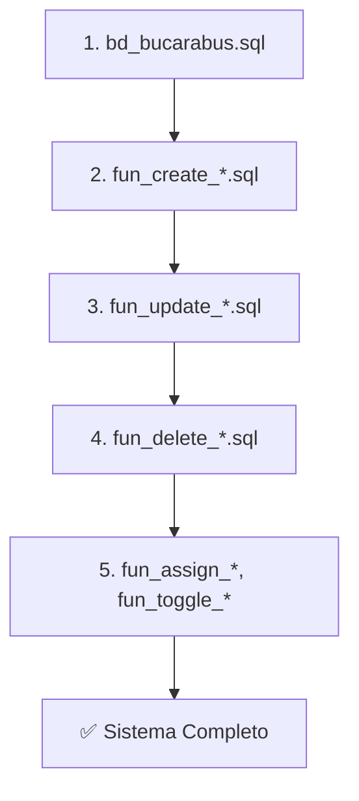
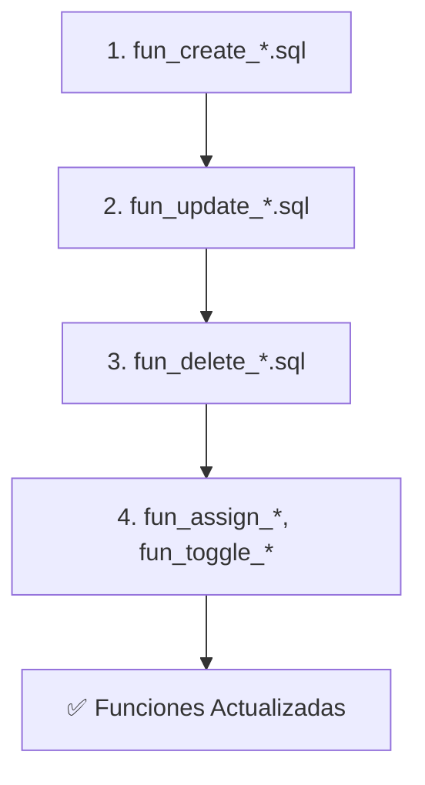

# 🗂️ Índice de Archivos - Base de Datos BucaraBUS v2.0

## 📋 Tabla de Contenidos

- [Scripts de Deployment](#-scripts-de-deployment)
- [Esquema Base](#-esquema-base)
- [Funciones CREATE](#-funciones-create)
- [Funciones UPDATE](#-funciones-update)
- [Funciones DELETE](#-funciones-delete)
- [Funciones Especiales](#-funciones-especiales)
- [Documentación](#-documentaci%C3%B3n)
- [Orden de Ejecución](#-orden-de-ejecuci%C3%B3n)

---

## 🚀 Scripts de Deployment

| Archivo | Tipo | Descripción | Uso |
|---------|------|-------------|-----|
| **deploy-all.sql** | SQL | Deployment completo (esquema + funciones) | `psql -U user -d db -f deploy-all.sql` |
| **deploy-functions-only.sql** | SQL | Solo funciones (sin esquema) | `psql -U user -d db -f deploy-functions-only.sql` |
| **deploy-functions.ps1** | PowerShell | Script automatizado para Windows | `.\deploy-functions.ps1` |
| **deploy-functions.sh** | Bash | Script automatizado para Linux/Mac | `./deploy-functions.sh` |

## 📊 Esquema Base

| Archivo | Tablas | Líneas | Descripción |
|---------|--------|--------|-------------|
| **bd_bucarabus.sql** | 9 | 526 | Esquema completo con tablas, índices, constraints, datos iniciales |

**Tablas incluidas:**
- `tab_users` - Usuarios del sistema
- `tab_roles` - Roles del sistema
- `tab_user_roles` - Relación usuarios-roles
- `tab_driver_details` - Detalles de conductores
- `tab_buses` - Catálogo de buses
- `tab_routes` - Rutas con geometría PostGIS
- `tab_favorite_routes` - Rutas favoritas de usuarios
- `tab_bus_assignments` - Historial de asignaciones bus-conductor
- `tab_trips` - Turnos/viajes programados

## ✨ Funciones CREATE

| Archivo | Funciones | Líneas | Descripción |
|---------|-----------|--------|-------------|
| **fun_create_user.sql** | 1 | ~300 | Crear usuarios en el sistema |
| **fun_create_bus.sql** | 1 | ~400 | Crear buses en el catálogo |
| **fun_create_driver.sql** | 1 | ~500 | Crear conductores con detalles |
| **fun_create_route.sql** | 1 | ~400 | Crear rutas con geometría PostGIS |
| **fun_create_trip.sql** | 2 | ~700 | Crear turnos/viajes (bulk + individual) |

**Funciones incluidas:**
- `fun_create_user(...)` - Crear usuario
- `fun_create_bus(...)` - Crear bus
- `fun_create_driver(...)` - Crear conductor
- `fun_create_route(...)` - Crear ruta
- `fun_create_trip(...)` - Crear turno individual
- `fun_create_trip_bulk(...)` - Crear múltiples turnos

## 🔄 Funciones UPDATE

| Archivo | Funciones | Líneas | Códigos Error | Estado |
|---------|-----------|--------|---------------|--------|
| **fun_update_user.sql** | 1 | 390 | 15 | ✅ v2.0 |
| **fun_update_bus.sql** | 1 | ~350 | ~18 | ✅ v2.0 |
| **fun_update_driver.sql** | 1 | 390 | 25 | ✅ v2.0 |
| **fun_update_route.sql** | 1 | 450 | 17 | ✅ v2.0 |
| **fun_update_trip.sql** | 2 | 685 | 39 (24+15) | ✅ v2.0 |

**Funciones incluidas:**
- `fun_update_user(...)` - Actualizar usuario (nombre, avatar)
- `fun_update_bus(...)` - Actualizar bus (todos los campos)
- `fun_update_driver(...)` - Actualizar conductor (detalles)
- `fun_update_route(...)` - Actualizar ruta (metadatos, no geometría)
- `fun_update_trip(...)` - Actualizar turno (tiempos, bus, estado)
- `fun_set_trip_bus(...)` - Asignar/desasignar bus a turno

**Características v2.0:**
- ✅ user_update es INTEGER (no VARCHAR)
- ✅ Validación de usuario updater (existe + activo)
- ✅ Validación de entidad (existe + activo)
- ✅ Validación "no changes" (al menos un campo)
- ✅ Smart update (solo actualiza si diferente)
- ✅ ROW_COUNT verification
- ✅ Error codes descriptivos (15-39 por función)
- ✅ TRY-CATCH con handlers específicos
- ✅ RAISE NOTICE para logging

## ❌ Funciones DELETE

| Archivo | Funciones | Líneas | Descripción |
|---------|-----------|--------|-------------|
| **fun_delete_driver.sql** | 1 | ~300 | Eliminar/desactivar conductor |
| **fun_delete_route.sql** | 1 | ~300 | Eliminar/desactivar ruta |
| **fun_delete_trip.sql** | 3 | ~600 | Eliminar turnos (bulk, by route, individual) |

**Funciones incluidas:**
- `fun_delete_driver(...)` - Eliminar conductor
- `fun_delete_route(...)` - Eliminar ruta (soft delete)
- `fun_delete_trip(...)` - Eliminar turno individual
- `fun_delete_trip_bulk(...)` - Eliminar múltiples turnos
- `fun_delete_trips_by_route(...)` - Eliminar turnos de una ruta

## 🔧 Funciones Especiales

| Archivo | Funciones | Líneas | Descripción |
|---------|-----------|--------|-------------|
| **fun_assign_driver.sql** | 1 | ~400 | Asignar/desasignar conductor a bus |
| **fun_toggle_bus_status.sql** | 1 | ~300 | Activar/desactivar bus |

**Funciones incluidas:**
- `fun_assign_driver(...)` - Asignar conductor a bus
- `fun_toggle_bus_status(...)` - Cambiar estado activo/inactivo

## 📚 Documentación

| Archivo | Tipo | Descripción |
|---------|------|-------------|
| **README_DEPLOYMENT.md** | Markdown | Guía completa de deployment |
| **INDEX.md** | Markdown | Este archivo (índice de archivos) |
| **API_INTEGRATION.md** | Markdown | Guía de integración con API (carpeta raíz) |
| **DATABASE_SETUP.md** | Markdown | Guía de configuración inicial (carpeta raíz) |

## 🔢 Orden de Ejecución

### Primera Instalación (Todo desde cero)



**Comando:**
```bash
psql -U bucarabus_user -d bucarabus_db -f deploy-all.sql
```

### Update Subsecuente (Esquema ya existe)



**Comando:**
```bash
psql -U bucarabus_user -d bucarabus_db -f deploy-functions-only.sql
```

### Ejecución Detallada

| Paso | Archivo | Depende de | Descripción |
|------|---------|------------|-------------|
| 1 | `bd_bucarabus.sql` | - | Crear tablas base |
| 2 | `fun_create_user.sql` | Paso 1 | Necesita tab_users |
| 3 | `fun_create_bus.sql` | Paso 1,2 | Necesita tab_users, tab_buses |
| 4 | `fun_create_driver.sql` | Paso 1,2 | Necesita tab_users, tab_driver_details |
| 5 | `fun_create_route.sql` | Paso 1,2 | Necesita tab_users, tab_routes |
| 6 | `fun_create_trip.sql` | Paso 1,2,5 | Necesita tab_trips, tab_routes |
| 7 | `fun_update_user.sql` | Paso 2 | Necesita fun_create_user |
| 8 | `fun_update_bus.sql` | Paso 3 | Necesita fun_create_bus |
| 9 | `fun_update_driver.sql` | Paso 4 | Necesita fun_create_driver |
| 10 | `fun_update_route.sql` | Paso 5 | Necesita fun_create_route |
| 11 | `fun_update_trip.sql` | Paso 6 | Necesita fun_create_trip |
| 12 | `fun_delete_driver.sql` | Paso 4 | Necesita tab_driver_details |
| 13 | `fun_delete_route.sql` | Paso 5 | Necesita tab_routes |
| 14 | `fun_delete_trip.sql` | Paso 6 | Necesita tab_trips |
| 15 | `fun_assign_driver.sql` | Paso 1,3,4 | Necesita tab_buses, tab_users |
| 16 | `fun_toggle_bus_status.sql` | Paso 3 | Necesita tab_buses |

## 📊 Estadísticas del Proyecto

### Resumen General

| Categoría | Cantidad | Total Líneas |
|-----------|----------|--------------|
| Scripts SQL | 5 | ~2,500 |
| Funciones CREATE | 6 | ~2,300 |
| Funciones UPDATE | 5 (7 funciones) | ~2,265 |
| Funciones DELETE | 3 (5 funciones) | ~1,200 |
| Funciones Especiales | 2 | ~700 |
| **TOTAL** | **21 archivos** | **~9,000 líneas** |

### Funciones por Categoría

- **CREATE**: 6 funciones
- **UPDATE**: 7 funciones (fun_update_trip tiene 2)
- **DELETE**: 5 funciones (fun_delete_trip tiene 3)
- **ESPECIAL**: 2 funciones
- **TOTAL**: **20 funciones PostgreSQL**

### Códigos de Error

| Función | Códigos Error | Coverage |
|---------|---------------|----------|
| fun_update_user | 15 | 100% |
| fun_update_bus | ~18 | 100% |
| fun_update_driver | 25 | 100% |
| fun_update_route | 17 | 100% |
| fun_update_trip | 24 | 100% |
| fun_set_trip_bus | 15 | 100% |
| **TOTAL UPDATE** | **114** | **100%** |

## 🎯 Características v2.0

### Auditoría Consistente

✅ Todos los campos `user_create` y `user_update` son **INTEGER**  
✅ Usuario del sistema: **1735689600** (Epoch 2025-01-01)  
✅ Referencias FK a `tab_users(id_user)`  
✅ ON DELETE SET DEFAULT para user_create  
✅ ON DELETE SET NULL para user_update  

### Validaciones Universales

✅ User creator/updater existe y está activo  
✅ Entidad existe antes de update/delete  
✅ Entidad está activa (can't update/delete inactive)  
✅ Formato de datos (email, plate, AMB, phone, etc.)  
✅ Business logic (transitions, dependencies)  
✅ "No changes" check (UPDATE functions)  
✅ ROW_COUNT verification  

### Error Handling

✅ Error codes descriptivos (no SQLSTATE genéricos)  
✅ TRY-CATCH con handlers específicos  
✅ RAISE NOTICE para logging  
✅ Mensajes en español user-friendly  
✅ 10+ ejemplos de uso en comments  

### Patrón OUT Parameters

✅ Todas las funciones retornan:
- `success BOOLEAN`
- `msg VARCHAR`
- `error_code VARCHAR`
- `id_* [type]` (ID de la entidad)

❌ Ninguna función usa RETURNS TABLE  
❌ Ninguna función usa RAISE EXCEPTION  

## 🔐 Usuario del Sistema

Todas las funciones requieren un usuario válido para auditoría:

```sql
-- Usuario del sistema (DEFAULT en campos user_create)
ID: 1735689600
Email: system@bucarabus.local
Nombre: Sistema Bucarabus
Rol: Administrador (4)

-- Uso en funciones
SELECT * FROM fun_create_user(
    1735689650,
    'test@example.com',
    '$2b$10$HASH...',
    'Usuario Test',
    NULL,
    1735689600  -- Usuario del sistema crea el registro
);
```

## 📞 Próximos Pasos

1. ✅ **Deployment**: Ejecutar scripts de deployment
2. ⏳ **Testing**: Probar todas las funciones con casos de uso
3. ⏳ **Backend**: Actualizar servicios para usar INTEGER en user_create/user_update
4. ⏳ **Frontend**: Actualizar UI para manejar nuevos error codes
5. ⏳ **Documentación**: Crear guía de migración para backend

---

**Version**: 2.0  
**Última Actualización**: Febrero 2025  
**Mantenedor**: Equipo BucaraBUS
